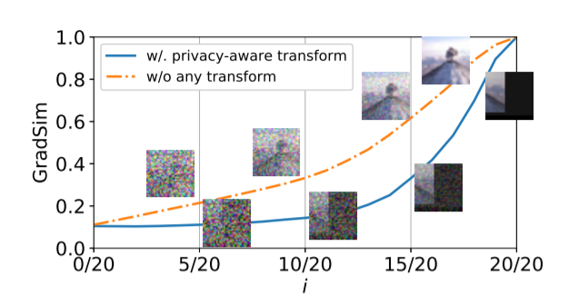
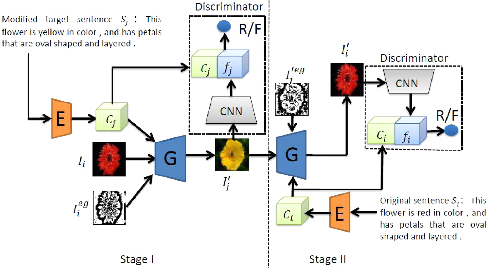

Our team is mainly committed to cutting-edge research in information security, including: applied cryptography, artificial intelligence security, big data security and privacy, multimedia security, and network and hardware security. We have published many outstanding achievements in top-tier academic conferences and journals. The research group has sufficient funds and regularly organizes academic and outdoor activities. It not only provides the international leading scientific research environment, but also creates a good living atmosphere for students. Our research group has close cooperation with Chinese Academy of Sciences, Huawei, ZTE, Datang Telecom and overseas universities such as Nanyang Technological University, Hong Kong Baptist University, George Mason University, Virginia Tech University, and National University of Singapore.

Here are some themes and techniques that we currently work on:

## Applied Cryptography

<!--  -->

As the foundation of information society, cryptography has been widely used in any scenarios related to digital data (e.g., Internet, Mobile communication).  Currently, the goal of cryptography research has long been extended from the initial communication security to computational security. However, existing cryptographic schemes usually require complex computation or communication, making them difficult to deploy, thus limiting their practicality. Our team aims to design new cryptographic schemes or pragmatize existing cryptographic schemes to provide for the application and deployment of cryptographic schemes in different scenarios.

<!-- Data privacy has been called “the most important issue in the next decade,” and has taken center stage thanks to legislation like the European Union’s General Data Protection Regulation (GDPR) and the California Consumer Privacy Act (CCPA). Researchers are scrambling to keep up with the requirements. In particular, “Privacy by Design” is integral to the GDPR and will likely only gain in popularity this decade. When using privacy preserving techniques, legislation suddenly becomes less daunting, as does ensuring data security which is central to maintaining user trust.  -->

<!-- Data privacy is a central issue to training and testing AI models, especially ones that train and infer on sensitive data. We are also actively exploring the direction of perfect privacy AI.  -->

<!-- 

<a href="/zh-cn/posts/applied-cryptography/">Read More <i class="fas fa-angle-double-right fa-fw"></i></a>

 -->

## Artificial Intelligence Security

<!--  -->
The past several years have witnessed the rapid development of Deep Learning technology. Various DL models today are widely adopted in many scenarios, e.g., image classification, speech recognition, language processing, robotics control. These applications significantly enhance the quality of life. However, new security threats are introduced to DNN models including backdoor attacks, adversarial attacks, model extraction attacks, privacy inference attacks, etc. It is critical to protect these DNN models against existing or potential integrity and privacy attacks, especially in safety-critical fields such as autonomous driving and smart medical care. Our team aims to promote the academic research and industrial practice of artificial intelligence security, and explore new theories, new methods and new techniques for artificial intelligence security and privacy protection.

<!-- 

<a href="/zh-cn/posts/artificial-intelligence-security/">Read More <i class="fas fa-angle-double-right fa-fw"></i></a>

 -->

## Big Data Security and Privacy

The value of big data analysis and mining lies in the prediction and analysis of unknown practices by using the large number theorem mentioned in probability theory. With the rapid development of science and technology, the rapid nonlinear growth of data has brought strategic opportunities for the development of big data. Among them, 2015 is the peak of big data development, and the state has announced the behavioral strategy of big data development. Because big data represents the direction of advanced productivity, it has become an unstoppable trend. However, the current situation of big data security is not very good, there are a lot of hackers through various means to obtain government, enterprise and personal privacy data, in recent years, there are many big or small privacy leakage problems.

With the development of mobile Internet and cloud services, the network boundary has disappeared, and traditional defensive and detection-oriented security protection measures have become inadequate, and big data security has faced challenges. At present, the main difficulty is that it is difficult to apply for access from users in an effective way and it is difficult to detect and control the behavior of developers.

<!-- 

<a href="/zh-cn/posts/big-data-security-and-privacy-protection/">Read More <i class="fas fa-angle-double-right fa-fw"></i></a>

 -->

## Multimedia Security

<!--  -->

Multimedia combines one or different content forms such as text, audio, images, animations, or video into a single interactive presentation.  Multimedia data is characterized by a large amount of information, strong correlation, and high redundancy, resulting in the limitations of high computational complexity and high power consumption in security solutions. Our team aims to deepen the academic research on multimedia information security and improve the reliable security guarantee of its production, transmission, distribution, and application.

<!-- At present, a variety of relevant security researches have been carried out around various forms of multimedia data in the open literature. Typical security researches include information hiding using multimedia as a cover carrier, digital watermarking for copyright protection and tracking of multimedia content, multimedia forensics for multimedia originality identification, multimedia perceptual hash and multimedia privacy for multimedia sensitive content protection and other researches related to multimedia security. -->

<!-- 

<a href="/zh-cn/posts/multimedia-security/">Read More <i class="fas fa-angle-double-right fa-fw"></i></a>

 -->

## Network and Hardware Security

Physical layer security refers to the use of natural physical characteristics to achieve information security, and it can also become physical endogenous security. Specifically, it can realize functions such as information encryption, password generation, and identification of legitimate users. It appears as a supplement to the upper layer security, which can greatly enhance the security performance of the entire system. The physical layer is the cornerstone of network operation and provides physical connections for data transmission. Without the physical layer, the network becomes a tree without roots and water without a source. The most basic thing is to ensure the safe operation of the physical layer of the network. Therefore, the physical layer Security is an indispensable and neglected part of the entire network security system.

<!-- 

<a href="/zh-cn/posts/hardware-security/">Read More <i class="fas fa-angle-double-right fa-fw"></i></a>

 -->
