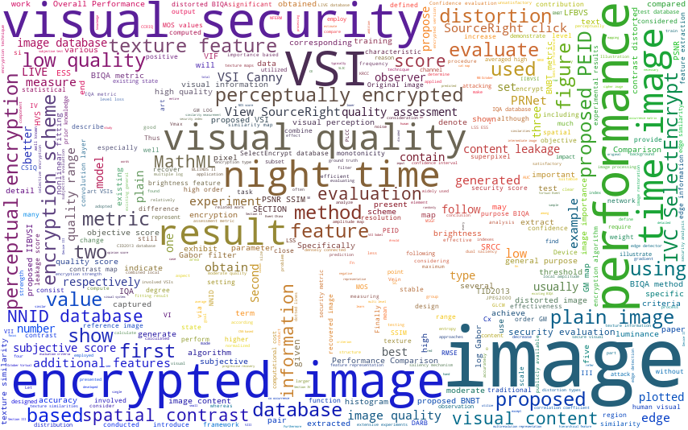

# 多媒体安全

# Introduction
Multimedia combines one or different content forms such as text, audio, images, animations, or video into a single interactive presentation.  Multimedia data is characterized by a large amount of information, strong correlation, and high redundancy, resulting in the limitations of high computational complexity and high power consumption in security solutions. Our team aims to deepen the academic research on multimedia information security and improve the reliable security guarantee of its production, transmission, distribution, and application.

## News

🎉 Jul. 2021: one paper accepted by ACM MM (**CCF A**)! Congrats to Ying!

## Grants

## Visual Security Analysis

* **[PRNet: A Progressive Recovery Network for Revealing Perceptually Encrypted Images](https://doi.org/10.1145/3474085.3475517)**

  Tao Xiang, Ying Yang, Shangwei Guo, Hangcheng Liu, Hantao Liu

  *ACM International Conference on Multimedia (ACM MM)*,  **CCF Rank A**

* **PEID: A Perceptually Encrypted Image Database for Visual Security Evaluation**

  Shangwei Guo, Tao Xiang, Xiaoguo Li, Ying Yang

  *IEEE Transactions on Information Forensics and Security*,   **CCF Rank A**

* **Visual Security Evaluation of Perceptually Encrypted Images Based on Image Importance**

  Tao Xiang, Ying Yang, Hangcheng Liu, Shangwei Guo

  *IEEE Transactions on Circuits and Systems for Video Technology*,  **CCF Rank B**

* **Blind Night-Time Image Quality Assessment: Subjective and Objective Approaches**

  Tao Xiang, Ying Yang, Shangwei Guo

  *IEEE Transactions on Multimedia*,  **CCF Rank B**

* **Perceptual visual security index based on edge and texture similarities**

  Tao Xiang, Shangwei Guo, Xiaoguo Li

  *IEEE Transactions on Information Forensics and Security*, **CCF Rank A**
